### ALBERT: A Lite BERT for Self-supervised Learning of Language Representations

<span style="font-size:80%">
  
- 저자:
   - Zhenzhong Lan, Sebastian Goodman, Piyush Sharma Radu Soricut (**Google Research**)
   - Mingda Chen,  Kevin Gimpel  (**Toyota Technological Institute at Chicago**)
- 발표:
   - Presenter: 윤주성
   - Date: 191113

----

### Who is an Author?
<span style="font-size:50%">

- 원래는 CV를 위주로 하던 친구인데 이번에 NLP꺼도 해본듯 (CVPR도 들고 있고..)
- 논문 인용수도 꽤 됨
- Google VR팀에서도 인턴했었음

http://www.cs.cmu.edu/~lanzhzh/

----

#### 느낀점
<span style="font-size:70%">
  
- 간단한 아이디어인데 실험을 엄청 많이 해놔서 paper를 만든느낌
- 실험이 의미는 있지만 직관적으로 예측가능한 결과임
- 간단한 아이디어도 사실 예전부터 적용되어야 했음 (weight sharing, decomposition)
- transformer 논문이 처음에 pretraining용이 아니다보니 당시 그 논문에서 빼먹었지만 당연히 앞으론 적용되었어야할 아이디어가 2년이 지나서야 적용된 느낌
- SOP가 NSP보단 Good이다
- SOP 할때 문장 단위가 아니라 textual segments로 한거 괜찮았음 (SEP도 그러면 segment단위로 넣겠네)
- MLM 을 n-gram masking 한건 좀 신기함 나쁘지 않음
- transformer에서 dropout을 없애는게 pretraining할 때 진짜 좋은지는 좀 더 검증해봐야할 듯
- 이 논문은 모델 그림이 없다(?)

----

#### Abstract
<span style="font-size:70%">

- Natural langauge representation을 pretraining을 통해 학습시키려 할때 모델 사이즈를 키우는건 성능향상을 하는데 도움을 줌
- 하지만 특정 포인트 이상으로 모델 사이즈가 커지는건 GPU/TPU 메모리 크기의 제한, 학습시간이 길어짐, 예상치 못한 model degradation등으로 인해 문제가 될 수 있음
- 이런 문제를 해결하기 위해 적은 메모리 사용과 BERT의 학습 속도를 높이기 위한 two parameter-reduction techniques을 제안함
- 실험적인 증거들은 제안하는 방법이 orginal BERT보다 더 낫다는 걸 보여줌
- 추가로, self-supervised loss를 추가헀는데 이는 inter-sentence coherence를 modeling하는데 초점을 맞췄음
- 결과적으로 BERT-large에 비해 적은 parameter를 갖고도 GLUE, RACE, SQuAD benchamrk에서 SOTA를 기록함

----

#### 1. Introduction
<span style="font-size:70%">
  
- Full network pre-training은 langauge representation learning 에서 새로운 breakthroughs를 기록해왔음 (Dai & Le, 2015; Radford et al., 2018; Devlin et al., 2019; Howard & Ruder, 2018)
- 많은 NLP tasks들이 학습 데이터가 제한되어있는데 이런 pre-trained model은 매우 큰 benefit을 주었음
- 그중 하나는 중국 중고등학교 영어 시험에 대한 reading comprehension task (RACE test)임 (```reading comprehension task designed for middle and high-school English exams in China, the RACE test (Lai et al., 2017)```) (~~저자가 중국인이라 그런가..이걸 첫번째 예시로 드네~~)
   - 논문에서 발표할땐 SOTA 44.1% acc였음
   - 최근 논문에서는 SOTA 83.2% acc
   - 본 논문에서 제안하는 모델은 89.4% acc로 SOTA가 되었고 pretrained language representations은 큰 도움이 되었음

----

#### 1. Introduction
<span style="font-size:70%">

- large network이 SOTA를 위해선 매우 중요했지만 이젠 real applications을 위해서 경량화하려는게 흔한 practice가 됨 (```It has become common practice to pre-train large models and distill them down to smaller ones (Sun et al., 2019; Turc et al., 2019) for real applications```)
- 모델 사이즈가 중요해졌기에, 이런 research question을 던짐 ```Is having better NLP models as easy as having larger models?```
- 이런 질문에 대한 한 가지 장애물은 하드웨어의 메모리 제한임
   - SOTA 모델은 보통 millions 또는 billions of params을 가짐
   - 분산학습 할때 param 개수가 많으면 거기에 비례해서 커뮤니케이션 오버헤드도 더 커지기 때문에 학습 속도도 느려짐
   - 모델의 hidden size를 BERT-large 처럼 단순히 늘려버리면 성능도 안좋아지는것 또한 발견함 (Figure 1, Table 1 참고)
   - 이러한 문제들은 모델 병렬화와 메모리 관리로 어느정도 해결가능하지만 communication overhead와 model degradation 문제는 해결할 수 없음

---

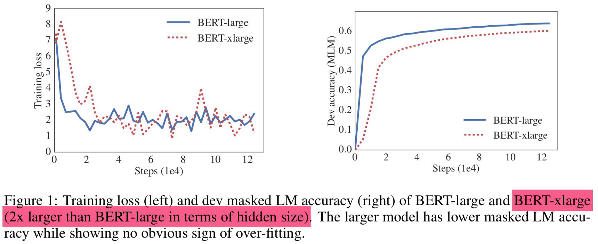


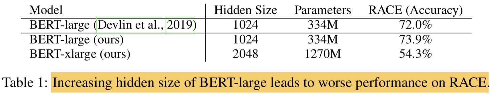

----

#### 1. Introduction
<span style="font-size:70%">

- 본 논문에서는 이러한 문제 해결을 위한 A Lite BERT (ALBERT) 구조를 디자인했음 (훨씬 적은 param을 사용)
- ALBERT는 two parameter reduction techniques을 사용함
   - factorized embedding parameterization
      - large vocabulary embedding matrix를 두개의 작은 matrices로 decomposing함
      - ```we separate the size of the hidden layers from the size of vocabulary embedding.```
      - 이렇게 분리하면, vocabulary embeddings의 parameter size를 크게 늘리지 않아도 hidden size를 더 쉽게 늘릴 수 있음
   - cross-layer parameter sharing
      - layer 간에 param을 share함으로써  network의 depth가 깊어져도 parameter가 증가하는걸 막을 수 있음
   - 위의 두가지 techniques으로 심각한 performance 손상 없이 param를 줄일 수 있었음

----

#### 1. Introduction
<span style="font-size:70%">

- BERT-large와 비슷한 configuration으로 ALBERT는 18배 적은 param을 갖고 학습도 1.7배 빨랐음
- param을 줄이는 기술은 Regularization 처럼 동작해서 학습도 안정적으로 할 수 있게 해주고, Generalization에도 도움을 줬음
- 더 나아가, ALBERT의 성능을 더 높이기 위해, sentence-order prediction (SOP)를 위한 self-supervised loss를 제안함
   - inter-sentence coherence에 포커싱을 맞춤
   - BERT에서 사용된 NSP loss가 효과가 없다는 걸 보이기 위해 사용함 (Yang et al., 2019; Liu et al., 2019)
- 이러한 방법들로 ALBERT configuration보다 더 scale up이 가능하게 되면서도 동시에 BERT-large 보다는 fewer param이 가능하게 되었음. 하지만 성능은 더 좋음.
- benchmark
   - the RACE accuracy to 89.4%
   - the GLUE benchmark to 89.4
   - the F1 score of SQuAD 2.0 to 92.2   

----

#### 2. Related work
##### 2.1 Scaling Up Representation Learning For Natural Language
<span style="font-size:70%">
  
- natural langauge에서 representation을 학습하는 것이 매우 유용하다는건 다양하게 보여져 왔음 
(e.g. word2vec) (Mikolov et al., 2013; Le & Mikolov, 2014; Dai & Le, 2015; Pe- ters et al., 2018; Devlin et al., 2019; Radford et al., 2018; 2019)
- 지난 2년간 가장 큰 변화는 pre-training word embeddings이나 contextualized embedding 패러다임에서 full-network pre-training 을 통해 task-specific fine-tuning하는 패러다임으로 넘어갔다는 것임
- 이러한 연구의 연장선에서, 모델의 크기가 크면 성능이 향상된다는 것들도 보여져왔음
- 하지만 기존 연구들은 hidden size를 1024로 셋팅한데 까지만 연구했고 본 논문에서는 2048로 늘려보았지만 성능이 더 악화되었음
- 그러므로 representation learning에서 scaling up 하는 것은 단순히 모델 사이즈를 증가시키는것 만큼 쉬운 것은 아님
- 추가로 computational constraints 때문에 실험하기도 어려움
   - Chen et al. (2016) 연구에서는 gradient checkpointing이라는 기법으로 memory requirements를 줄임
   - Gomez et al. (2017) 연구에서는 next layer로부터 이전 layer의 activation을 reconstruction 하는 방법을 제안해서 intermeidate activations을 저장하지 않아도 되게함
   - 두 방법 모두 메모리 사용은 감소시켰지만 속도가 느림
   - 제안하는 방법은 속도도 빠르게하고 paramter-reduction으로 메모리 사용도 줄임
 
----
 
##### 2.2 Cross-Layer Parameter Sharing
<span style="font-size:70%">
  
- Transformer 구조 자체는 standard encoder-decoder task를 다뤘지 pretraining/finetuniong setting을 염두해둔건 아님
- 기존의 연구들은 corss-layer parameter sharing (Universal Transformer, UT)이 LM과 subject-verb agreement에 도움이 됨을 보여줌 (Dehghani et al. (2018))
- 최근 Bai et al. (2019) 가 제안한 Deep Equilibrium Model (DQE) 모델에서는 input embedding과 output embedding이 특정 layer에서 equilibrium point에 도달할 수 있다는걸 보여줌 (~~무슨 말이죠..~~)
- 본 논문에서 발견한 것은 이와 다름 (```Our observations show that our embeddings are oscillating rather than converging```)

---

##### 2.3 Sentence Ordering Objectives
<span style="font-size:70%">
  
- ALBERT는 pretraining loss중 하나로 두개의 연속된 text 세그먼트의 순서를 맞추는걸 사용함
- 담화의 coherence와 coheision은 이전에도 많은 연구가 이뤄졌었음 (```Coherence and cohesion in discourse have been widely studied and many phenomena have been identified that connect neighboring text segments (Hobbs, 1979; Halliday & Hasan, 1976; Grosz et al., 1995)```)
- Skip-thought (Kiros et al., 2015) and FastSent (Hill et al., 2016) 처럼 sentence embeddings들은 문장 주변의 단어들을 예측하도록 sentence를 인코딩하는 방식을 사용했음
- 다른 objectives로는 단지 주변이 아닌 미래의 문장들을 예측하거나 discourse markers를 예측하는 방법으로 sentence embedding을 학습하기도 했음 (```Other objectives for sentence embedding learning include predicting future sentences rather than only neighbors (Gan et al., 2017) and predicting explicit discourse markers (Jernite et al., 2017; Nie et al., 2019)```)
- 본 논문에서 사용하는 방법은 Jernite et al. (2017)에서 제안된 ```sentence ordering objective```와 비슷함
- 대부분의 above work와는 달리 ```본 논문에서 사용하는 loss는 textual segments 단위임. sentence가 아니라.```
- BERT에서 사용된 NSP와 비교해서 SOP이 더 challenging pretarining task라는걸 확인함
- 본 논문과 거의 동시에 Wang et al. (2019) 논문도 SOP를 다뤘는데 차이점은 본논문에서는 binary classificaiton인데 저기서는 three-way classification임 (~~어떤 종류로 클래스를 나눴을까~~)

---

#### 3. The Elements of ALBERT
##### 3.1 Model Architecture Choices
<span style="font-size:70%">
  
- ALBERT의 backbone은 BERT와 비슷함 (transformer encoder with GELU nonlinearities) 
- 구조에 있어 3가지의 contribution은 다음과 같음 
###### Factorized embedding parameterization
###### Cross-layer parameter sharing
###### Inter-sentence coherence loss
---

##### 3.1 Model Architecture Choices
###### Factorized embedding parameterization
<span style="font-size:50%">

- BERT, XLNet, RoBERTa 등에서 WordPiece embedding size E는 hidden layer size H와 묶여있다. (왜냐하면, attention 자체가 dimension 자체를 줄이는게 아니라 weighted sum 개념이기 때문에 input dim -> output dim이 되기 때문)
- $$ E \equiv H $$
- 이러한 선택은 modeling 과 practical reasons에 있어서 suboptimal임
   - modeling 관점:
      - WordPiece embeddings은 context-independent representations를 학습하는 것임
      - 반면, hidden-layer embeddings은 context-dependent representation을 학습하는 것임
      - BERT-like representation의 power는 context-dependent representation에서 옴
      - 아래와 같은 경우 일때, WordPiece embedding size E를 hidden layer size H와 분리하는 것은 더 효율적인 모델 파라미터 사용으로 이어질 수 있음 
      - $$ H \gg E $$
   - practical 관점:
      - NLP에서 vocab size V는 굉장히 큼
      - 만약 E == H 라면 H 가 증가하면 size of embedding matrix도 증가하게됨 
      - $$ V \times E $$
      - 결과적으로 매우 쉽게 billions of params을 갖게됨
      - 하지만 실제 업데이트되는 건 적음 (update sparsely)
- 그러므로 본 논문에서는 factorization을 사용해서 embedding params을 two smaller matrices로 분리함
- one-hot을 바로 hidden space로 보내는게 아니라 embedding space로 보낸 후에 hidden space로 projection함 (~~사실 너무나 당연한거 아닌가..확실히 transformer의 naive한 초기셋팅이 안고쳐지다가 여기에 와서야 고쳐지는군~~)

$$
O(V \times H) \text { to } O(V \times E+E \times H)
$$

- 이러한 parameter reduction은 H >> E 일때 매우 중요함

---
##### 3.1 Model Architecture Choices
###### Cross-layer parameter sharing
<span style="font-size:50%">

- 다른 여러 방법들이 있었지만 ALBERT에서는 layer간 모든 parameter를 공유함
- 본 논문에서의 관찰과는 다른 결과를 보였던 선행연구들
   - Universal Transformer (UT)와 Deep Equilibrium Models (DQE)에서도 비슷한 전략이 있었지만 UT 논문에서는 UT가 vanilla Transformer보다 높은 성능을 보여줌 (본논문에서 실험한 결과와는 다름)
   - DQE도 equilibrium point가 있다고 했지만 본 논문의 실험에서는 embeddings이 수렴하기보단 oscillating 하게 보였음
- layer를 올라갈 수록 ALBERT가 BERT보다 더 smooth하게 값이 바뀌는걸 볼 수 있는데 이건 weighty-sharing이 network parameters의 stabilizing에 효과가 있음을 보여줌
- DQE와는 다르게 절대 0으로 수렴하는 현상이 보여지지 않는걸로 봐서 ALBERT의 solution space가 DQE와 매우 다르다는걸 알 수 있음

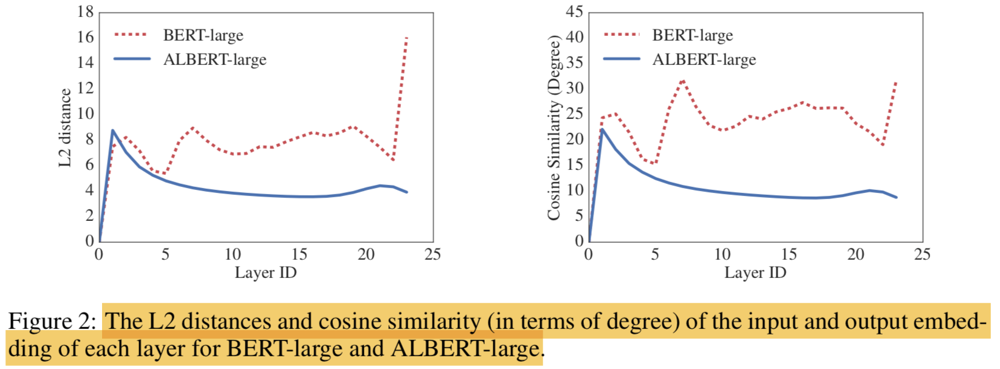

----
##### 3.1 Model Architecture Choices
###### Inter-sentence coherence loss
<span style="font-size:50%">

- MLM loss에 추가해서 BERT에서는 NSP loss를 사용했음
- 하지만 그간의 연구들 (Yang et al., 2019; Liu et al., 2019)은 NSP가 unreliable하다 판단했고, 지워버렸음 (실제로 downstream task performance 결과도 그랬음)
- 본 논문에서는 NSP가 효과가 없는 것이 MLM에 비해 어렵지 않은 태스크기 때문이라고 추측함
- NSP는 topic prediction이나 coherence prediction task의 결합으로 볼 수 있음 (topic으로 볼수 있는 또 다른 이유는 문장을 랜덤으로 뽑을때 다른 문서에서 뽑음)
- 하지만 topic prediction은 coherence prediction에 비해 비교적으로 학습하기 쉽고 MLM loss로 학습해서 배우는 것과 비교적으로 더 오버랩됨
- langauge understanding 관점에서 inter-sentence modeling은 중요하기 때문에 을 유지시키기로 함
- 대신 coherence에 기반을 둔 loss를 제안하기로 했고 sentence-order prediction (SOP) loss 를 사용하기로 함
- topic prediction을 피하고, 대신 inter-sentence coherence에 집중함
- positive examples은 BERT와 같이 같은 문서에서 연속된 2개의 segments를 사용
- negative examples은 동일한 two consecutive segments를 순서만 바꿔서 사용함 (~~동일한걸 쓰면 의미가 있나.. 약간 난이도를 낮춘건가..segment embedding에 대한 값이 매우 중요하게 학습되는 결과만 낳을거 같은데~~)
- 이러한 task는 모델이 discourse-level coherence properties에 대해 finer-grained distinctions을 학습하게 함
- ```NSP는 SOP를 거의 하나도 못풀지만, SOP는 NSP를 reasonable한 수준에서 해결 할 수 있는 것으로 나타남```
- 결과적으로 ALBERT는 multi-sentence encoding task에 대한 downstream task performance를 개선할 수 있었음

----

##### 3.2 Model Setup
<span style="font-size:70%">
- BERT와 ALBERT의 모델을 hyperparameter setting으로 비교해봄

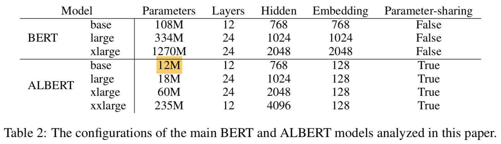

- ALBERT-large는 BERT-large에 비해 18배 적은 params을 가짐 (18M vs 334M)
- Hidden size를 2048까지 하면 BERT-xlarge는 1.27 billion params을 가짐
- 반면에 ALBERT는 60M밖에 안함
- ALBERT-xxlarge 모델의 경우 12-layer network에 대한 결과를 기록함 24-layer network은 결과는 비슷한데 computationally more expensive해서 기록 안함
----

#### 4. Experimental Results
##### 4.1 Experimental Setup
<span style="font-size:50%">
  
- BERT와 비교하기 위해 비슷하게 셋팅함
- Data: (for pretraining, 16GB) 
  - BookCORPUS
  - English Wikipedia
- Format:
  - $$ [\mathrm{CLS}] x_{1}[\mathrm{SEP}] x_{2}[\mathrm{SEP}], \text { where } x_{1}=x_{1,1}, x_{1,2} \cdots \text { and } x_{2}=x_{1,1}, x_{1,2} \cdots $$
  - length: 512
- Noise:
   - randomly generate input (10%)
- Vocab:
   - 30000 (tokenized using SentencePiece)
- MLM:
   - n-gram masking (Joshi et al., 2019) 사용
   - each n-gram mask의 length는 랜덤하게 선택되고, 길이 n에 대한 확률은 다음과 같음
   - $$ p(n)=\frac{1 / n}{\sum_{k=1}^{N} 1 / k} $$
   -  (~~길이가 길면 선택될 확률이 낮다?!~~)
   - maximum length of n-gram: 3 (이렇게하면 "White House correspondents" 과 같은 단어도 잡을 수 있음)
- Training:
   - Batch size: 4096
   - Optim: LAMB 
   - Lr: 0.00176 (You et al., 2019)
   - Steps: 125,000
   - Machine: Cloud TPU V3 (# of TPUs used for training ranged from 64 to 1024)

---

##### 4.2 Evaluation Benchmarks
<span style="font-size:70%">
  
###### 4.2.1 Intrinsic Evaluation

  
- 학습 과정을 모니터링 하기 위해 SQuAD와 RACE로부터 dev set 만들어서 테스트함 (~~Deview때 네이버가 보여준거랑 똑같네~~)
- MLM과 sentence classification task의 accuracy를 모두 확인함
- 모델이 잘 학습되서 수렴하는지만 확인하려고함

###### 4.2.2 Downstream Evaluation
- GLUE (the General Language Understanding Evaluation)
- SQuAD (the Standford Question Answering Dataset)
- RACE (the ReAding Comprehension from Examinations dataset)
- dev set에 대해서 early stopping 해서 학습시킴

---
##### 4.3 Overall Comparison Between BERT and ALBERT
<span style="font-size:70%">

- with only around 70% of BERT-large’s parameters, ALBERT-xxlarge achieves significant improvements over BERT-large
- measured by the difference on development set scores for several representative downstream tasks: SQuAD v1.1 (+1.9%), SQuAD v2.0 (+3.1%), MNLI (+1.4%), SST-2 (+2.2%), and RACE (+8.4%)
- We also observe that BERT-xlarge gets significantly worse results than BERT-base on all metrics. This indicates that a model like BERT-xlarge is more difficult to train than those that have smaller parameter sizes.
-  Because of less communication and fewer computations, ALBERT models have higher data throughput compared to their corresponding BERT models.

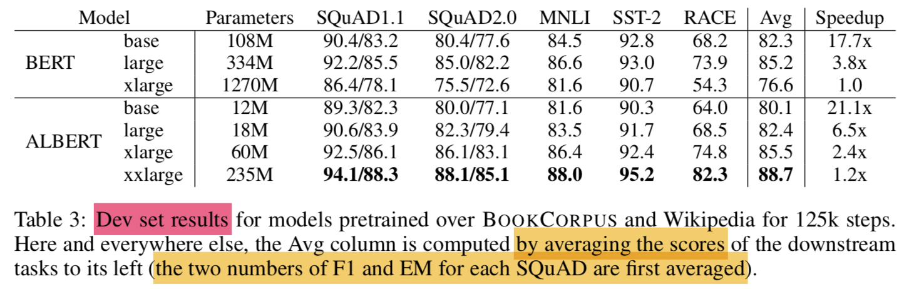

---

##### 4.4 Factorized Embedding Parameterization
<span style="font-size:70%">

- the effect of changing the vocabulary embedding size E using an ALBERT-base configuration setting
- Under the non-shared condition (BERT-style):
   - larger embedding sizes give better performance, but not by much.
- Under the all-shared condition (ALBERT-style):
   - an embedding of size 128 appears to be the best

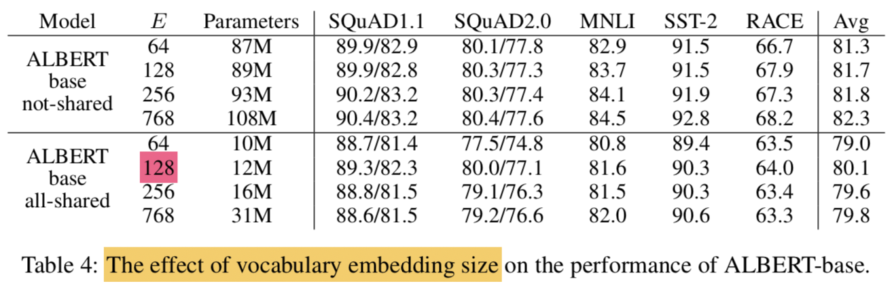

----

##### 4.5 Cross-Layer Parameter Sharing
<span style="font-size:50%">

- experiments for various cross-layer parameter-sharing strategies, using an ALBERT-base configuration (Table 2) with two embedding sizes (E = 768 and E = 128)
- compare 
   - all-shared strategy (ALBERT-style)
      - hurts performance under both conditions
      - but it is less severe for E = 128 (- 1.5 on Avg) compared to E = 768 (-2.5 on Avg)
   - the not-shared strategy (BERT-style)
   - intermediate strategies in which 
      - only the attention parameters are shared (but not the FNN ones) 
         - sharing the attention parameters results in no drop when E = 128 (+0.1 on Avg), and a slight drop when E = 768 (-0.7 on Avg)
      - only the FFN parameters are shared (but not the attention ones)
         - most of the performance drop appears to come from sharing the FFN-layer parameters
- other strategy
   - divide the L layers into N groups of size M , and each size-M group shares parameters
      - the smaller the group size M is, the better the performance we get. However, decreasing group size M also dramatically increase the number of overall parameters. We choose all-shared strategy as our default choice


----
##### 4.6 Sentence Order Prediction (SOP)

<span style="font-size:70%">

- compare head-to-head three experimental conditions for the additional inter-sentence loss
   - none (XLNet- and RoBERTa-style)
   - NSP (BERT-style)
   - SOP (ALBERT-style) (base config)
- the NSP loss brings no discriminative power to the SOP task (52.0% accuracy, similar to the random-guess performance for the “None” condition)
   - NSP ends up modeling only topic shift
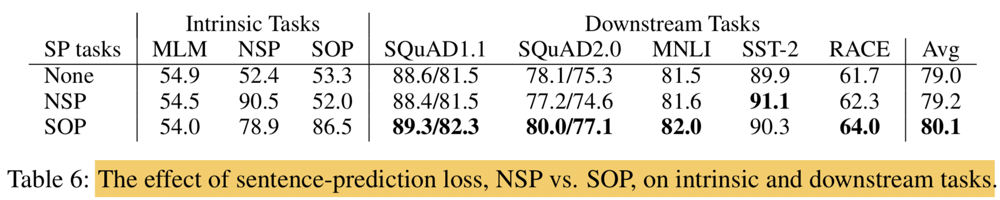

----


##### 4.7 Effect of Network Depth and Width

<span style="font-size:70%">
  
- check how depth (number of layers) and width (hidden size) affect the performance of ALBERT
- the performance of an ALBERT-large configuration
   - Layer 개수로 실험: 12 layer 이상부터는 큰 성능차이 없음
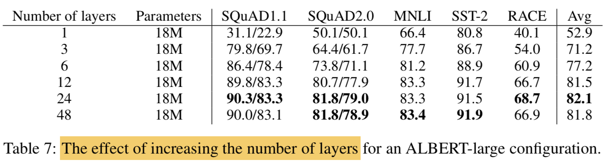
   - Hidden size로 실험: 4096 정도가 괜찮았음 (~~왜 3-layer로 한거지..~~)
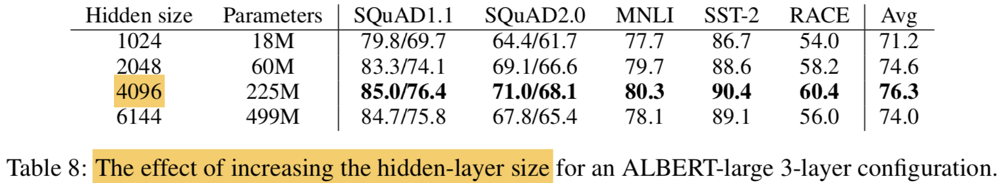

---

##### 4.8 What if we train for the same amount of time?
<span style="font-size:70%">

- Table 3에서는 BERT-large 가 ALBERT-xxlarge 보다 3.17배 빠름
- 보통 학습을 오래할수록 성능도 좋아짐
- 데이터의 epoch을 맞춰서 실험하기보다 절대 시간을 맞춰서 실험해보기로 함 (comparison in which, instead of controlling for data throughput (number of training steps), we control for the actual training time (i.e., let the models train for the same number of hours))
- BERT로 34시간동안 400k step돌린 것과 ALBERT로 32시간동안 125k 돌린것이 얼추 시간이 비슷하니 성능을 비교해보기로함 (the performance of a BERT-large model after 400k training steps (after 34h of training), roughly equivalent with the amount of time needed to train an ALBERT-xxlarge model with 125k training steps (32h of training))
- 결과는 ALBERT-xxlarge가 BERT-large보다 확실히 좋음 (ALBERT-xxlarge is significantly better than BERT-large: +1.5% better on Avg, with the difference on RACE as high as +5.2%)

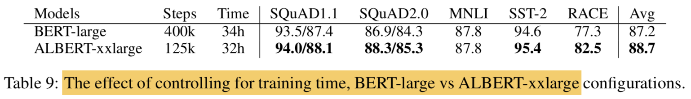

----

##### 4.9 Do very wide ALBERT models need to be deep(er) too?
<span style="font-size:70%">

- Hidden size가 크면 네트워크도 더 깊게 쌓아야되는지 실험함
- H=1024인 경우에 12-layer와 24-layer차이가 크지 않았음 (sec 4.7)
- H=4096인 경우는 또 다를수 있으니 테스트해봤는데 결과는 큰 차이가 없게 나옴

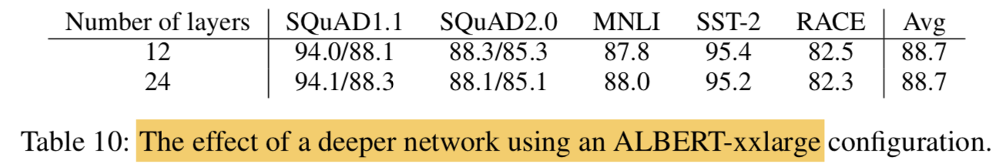

----

##### 4.10 Additional training data and dropout effects
<span style="font-size:70%">
  
- pretraining data는 Wikipedia와 BookCORPUS만 썼는데, XLNet이나 RoBERTa에서 썼던것 처럼 추가 데이터를 쓰면 어떤 효과가 있는지 알아보고자함
- additional data가 있을때 
   - 확실히 MLM이 좋아짐
   - downstream task도 좋아졌지만 SQuAD는 나빠짐
   - SQuAD는 Wikipedia-based라서 out-of-domain training material의 영향을 받았을거라 추측
- 1M steps을 학습시켜도 모델이 training data에 overfit이 안되서 dropout을 없애버림
- dropout 없애니 MLM이 더 잘됨
- As a result, we decide to remove dropout to further increase our model capacity. 

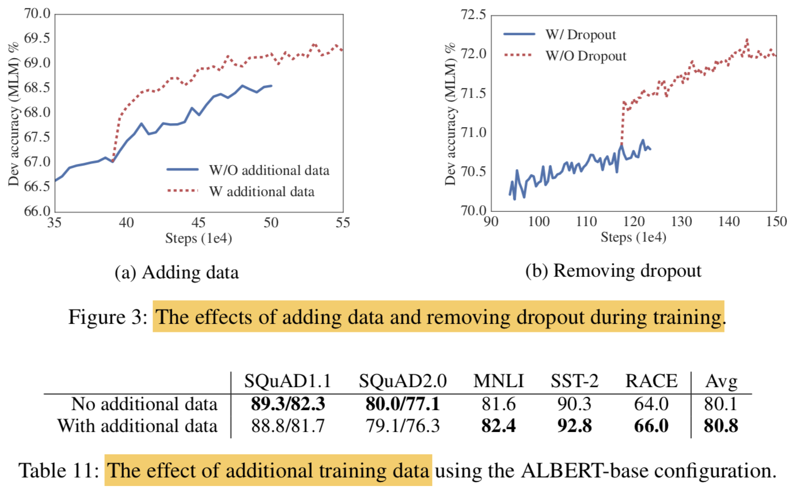

----

##### 4.10 Additional training data and dropout effects
<span style="font-size:70%">

- dropout을 빼니 downstream 결과도 더 좋아짐
   - 실험적으로 (Szegedy et al., 2017) 그리고 이론적으로 (Li et al., 2019) batchnorm과 dropout을 CNN에 쓰면 성능이 더 떨어진다는 결과도 있음 (combination of batch normalization and dropout in Convolutional Neural Networks may have harmful results)
   - 예측하기로는 transformer 구조에서 dropout이 performance를 떨어뜨리는거 같은데 다른 transformer based model에서도 검증이 필요할 것 같다고함
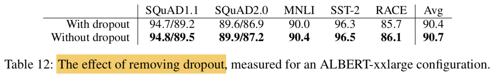

----

##### 4.11 Current state-of-te-art on NLU tasks
<span style="font-size:50%">

- dev set 성능 기준으로 선택함
- The single-model ALBERT:
   - the best-performing settings discussed: an ALBERT-xxlarge configuration (Table 2) **using combined MLM and SOP losses, and no dropout**
- the final ensemble model ALBERT:
   -  the number of checkpoints considered for this selection range **from 6 to 17**, depending on the task
- single model과 ensemble 모두 SOTA 기록
   - GLUE score of 89.4
   - SQuAD 2.0 test F1 score of 92.2
   - RACE test accuracy of 89.4
      - RACE test의 경우 크게 좋아짐 (jump of +17.4% absolute points over BERT (Devlin et al., 2019), +7.6% over XLNet (Yang et al., 2019), +6.2% over RoBERTa (Liu et al., 2019), and 5.3% over DCMI+ (Zhang et al., 2019))
- single model의 기존 SOTA의 ensemble보다 좋다고 어필
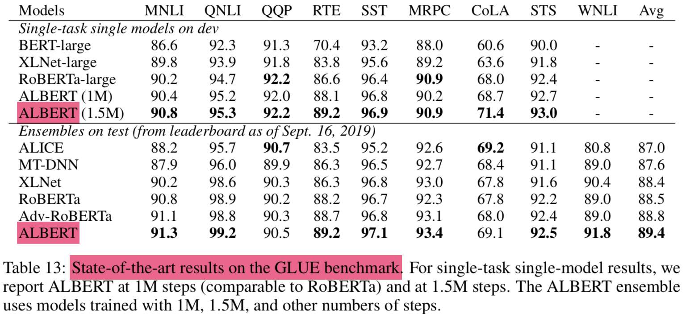

----
##### 4.11 Current state-of-te-art on NLU tasks
<span style="font-size:50%">

- dev set 성능 기준으로 선택함
- The single-model ALBERT:
   - the best-performing settings discussed: an ALBERT-xxlarge configuration (Table 2) **using combined MLM and SOP losses, and no dropout**
- the final ensemble model ALBERT:
   -  the number of checkpoints considered for this selection range **from 6 to 17**, depending on the task
- single model과 ensemble 모두 SOTA 기록
   - GLUE score of 89.4
   - SQuAD 2.0 test F1 score of 92.2
   - RACE test accuracy of 89.4
      - RACE test의 경우 크게 좋아짐 (jump of +17.4% absolute points over BERT (Devlin et al., 2019), +7.6% over XLNet (Yang et al., 2019), +6.2% over RoBERTa (Liu et al., 2019), and 5.3% over DCMI+ (Zhang et al., 2019))
- single model의 기존 SOTA의 ensemble보다 좋다고 어필

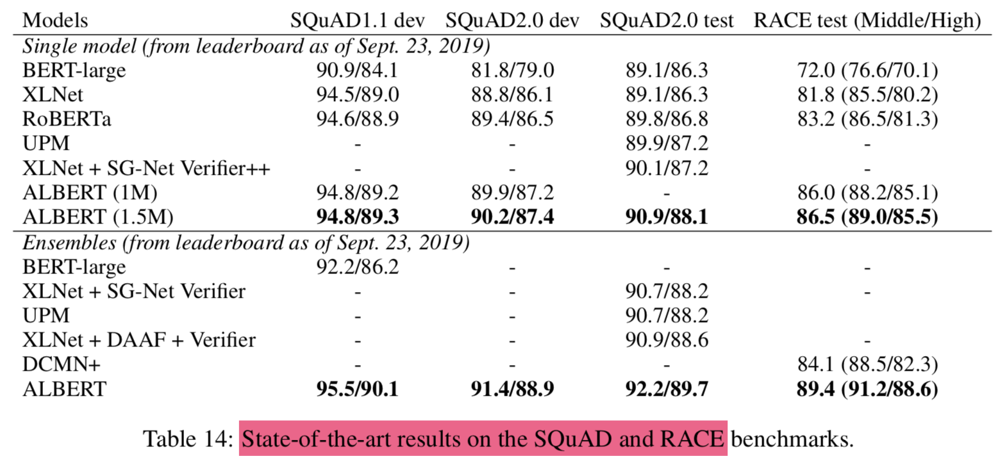

----

#### 5. Discussion
<span style="font-size:70%">

- ALBERT-xxlarge 모델이 BERT-large보다 params이 적고 성능도 더 좋지만 computationally more expensive함
- 앞으로는 spare attetnion (Child et al., 2019)나 block attention (Shen et al., 2018)등으로 ALBERT의 infernece speed를 높이는게 중요해보임
- representation을 위해 더 나은 LM 학습 방법이 필요해보임
- langauge representation에서는 SOP가 훨씬 더 유용한걸 확인함
- 더 다양한 self-supervised training losses가 있을 것임

