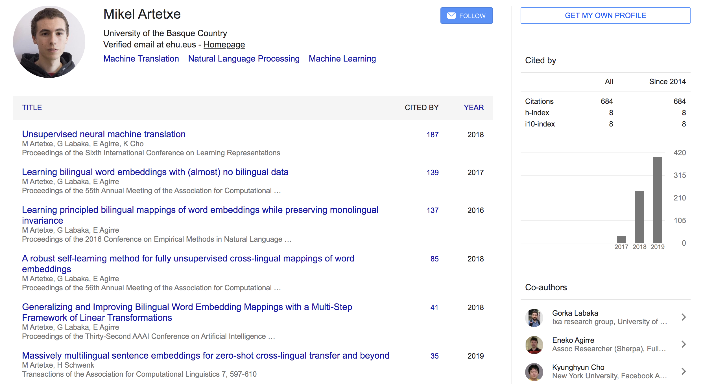
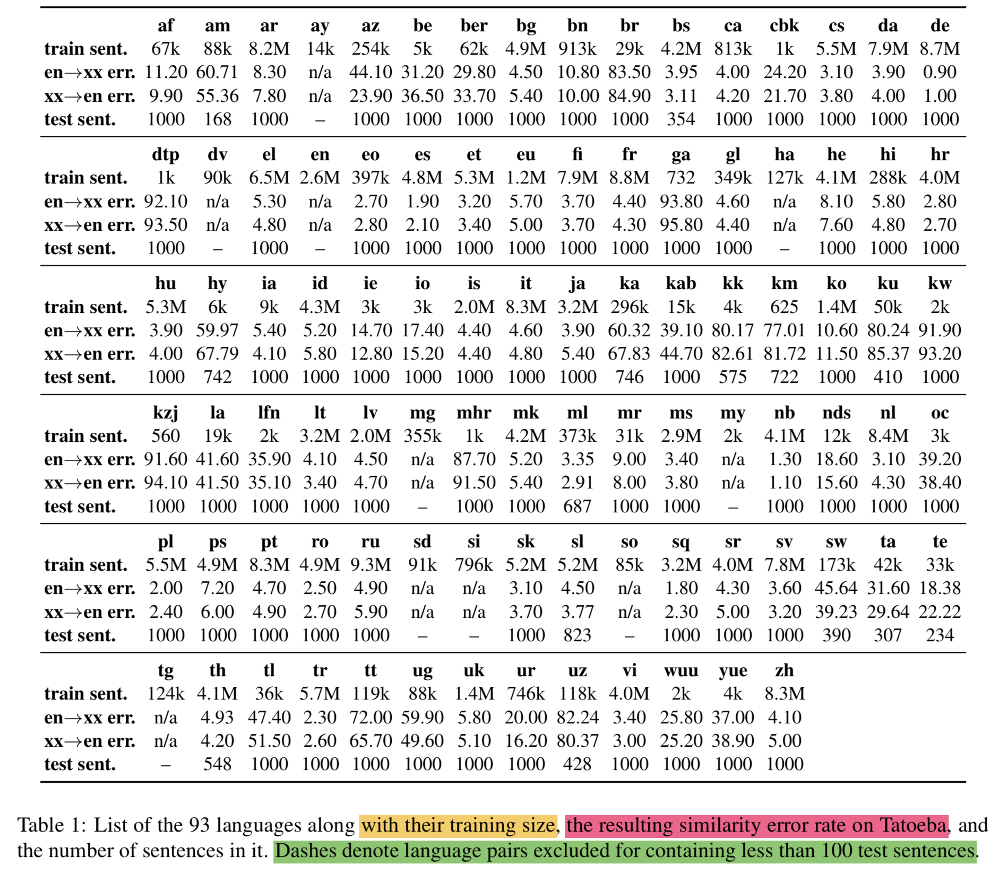
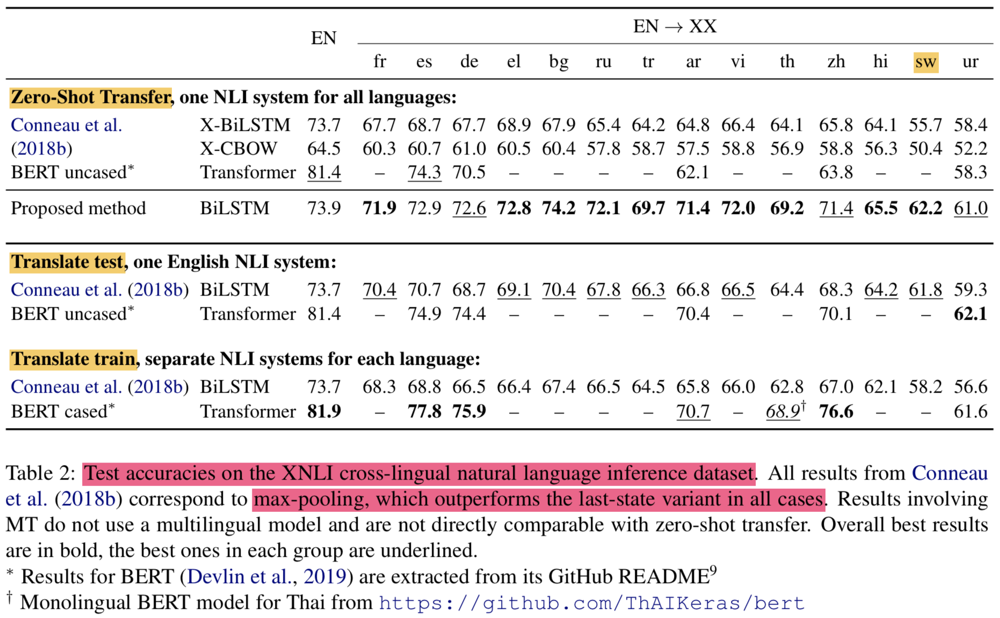
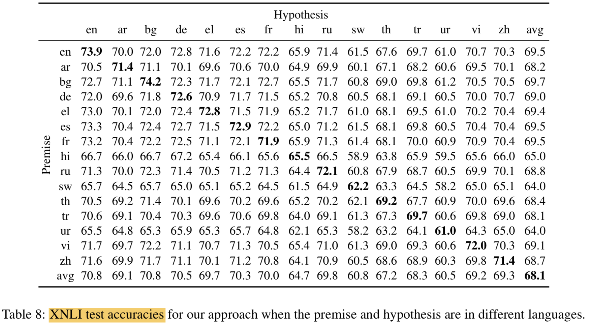
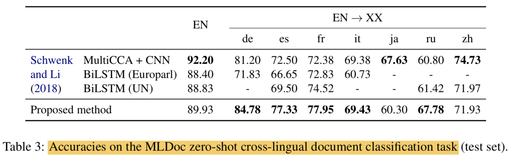
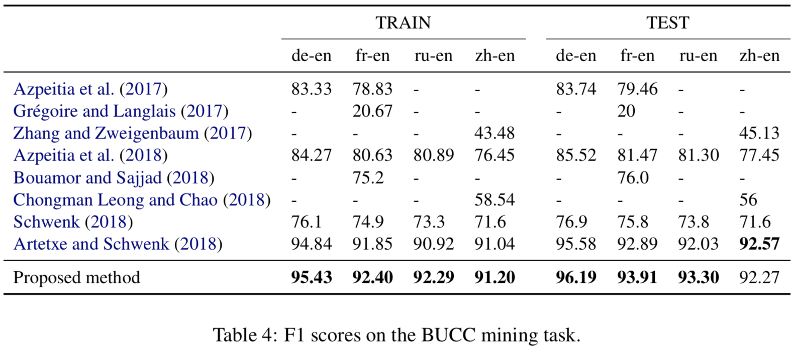
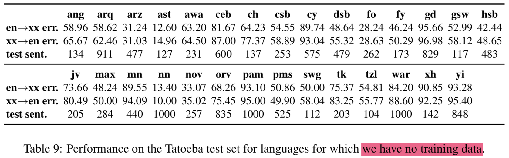
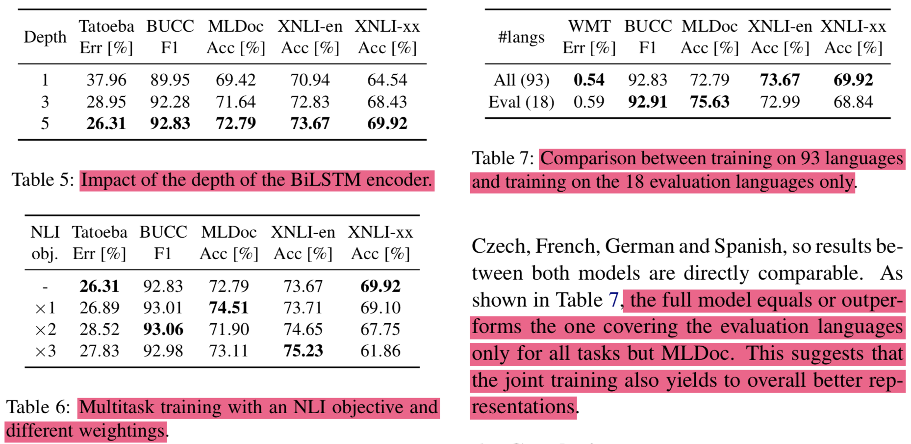

### Massively Multilingual Sentence Embeddings for Zero-Shot Cross-Lingual Transfer and Beyond

<span style="font-size:80%">
  
- 저자:
   - Mikel Artetxe (**University of the Basque Country (UPV/EHU)**)
   - Holger Schwenk (**Facebook AI Research**)

- 발표:
	- Presenter: 윤주성
	- Date: 191016 	

----

### Who is an Author?
<span style="font-size:50%">
  
Mikel Artetxe 라는 친구인데 주로 번역쪽 태스크를 많이 한 것 같고 조경현 교수님하고도 co-author 이력이 있음. 페북에서 인턴할때 쓴 논문임.



----

#### 느낀점
<span style="font-size:50%">
  
- 결국 이 논문도 parallel corpus가 필요하다고함. 이걸 통해 multilingual sentence embedding을 얻는 것임
- Translation이 되게 학습시켜서 encoder를 훈련함
- 대신에 그 양이 좀 적어도 다양한 언어에 대해서 얻을 수 있게 하는 것
- 영어로만 transfer learning 시켰는데도 다른언어도 적용된다는 점은 의미있음
- encoder가 BPE를 통해 language independent하게 모델링했다는게 좀 의미가 있긴한데 한편으로는 universal한 구조다보니 좀 개별언어에 대해서 성능이 최적화되진 않겠다는 생각(~~이지만 논문에선 결과가 괜찮음~~)
- language ID로 decoder에 언어정보를 주는건 꽤 괜찮은 아이디어였다고 생각
- parallel corpus alignment하는거 어떻게하니.. 고생이 눈에 훤함 (꼭 다할 필요가 없다고 했지만서도)
- 이번 논문은 약간 Scaling 으로 승부한 케이스인것 같음 (제목 자체가 그렇지만)
- Scaling을 키워서 실험할 줄 아는것도 결국 연구자의 역량..이라면 인프라가 중요하고 인프라가 중요하다면 configuration 잘하는건 기본이고, ~~실험비가 많거나 회사가 좋아야(?) 너무 스케일 싸움으로 가는것 같은 논문을 보면 왠지 모르게 아쉽고 씁쓸하다(?)~~
- 보통 transfer랑 one-shot, few-shot 등의 용어가 나오는데 fine-tune 안한다고해서 zero-shot이라고 한듯
- ```Language-Agnostic``` 라는 용어: 언어에 구애받지 않는다라는 뜻
- BERT 등 최신 논문과도 비교했지만(~~1년이 지났으니 최신이라고 이제 할수있을지..~~) 본 논문의 기법 자체는 좀 옛날 기법이라는 생각이 듬
- ~~논문의 설명이 잘나와있으나 몇가지 좀 생략되어있음 (은근 불친절한)~~

---


----

#### Abstract
<span style="font-size:70%">
  
- 93개의 언어에 대해 joint multilingual sentence embedding representation을 학습하는 모델 제안
- single BiLSTM encoder에 shared BPE vocab을 사용함 (cover all language)
- auxiliary decoder와 결합시켜서 parallel corpora에 대해 학습시킴
- 이러한 방식으로 English annotated data만 사용해서 분류기를 학습시킨 후 93개 언어에 대해 모델 구조 변경없이 transfer가 가능하게 함
- 실험에 사용한 데이터셋에서는 의미있는 결과를 얻었음
   - cross-lingual natural language inference (XNLI dataset)
   - cross-lingual document classification (ML- Doc dataset)
   - parallel corpus mining (BUCC dataset)
- 112개의 언어가 aligned setence되어있는 새로운 테스트셋(Tatoeba)도 소개함
- 적은 언어 자원으로도 multilingual similarity search가 꽤 잘나오는 sentence embedding을 얻은 것을 보여줌
- trained encoder & test set: https://github.com/facebookresearch/LASER


----

#### 1. Introduction
<span style="font-size:70%">
  
- 딥러닝 나와서 NLP가 발전했지만 이런 방법은 data hungry하고 많은 현실적인 시나리오에서 응용되기에 제약이 있음
- 여러 인기있는 방법들은 이런 이슈를 없애려했고, 그중 첫번째가 unlabeled data로 general langauge representation을 만드는 것임
   - 가장 대표적인게 word embeddings (Mikolov et al., 2013b; Pennington et al., 2014)
   - 최근엔 sentence-level representation에 대해서 연구가 이를 대체했음 ex. BERT (Peters et al., 2018; Devlin et al., 2019)
- 이런 연구들은 각 언어에 대해 따로 모델을 학습시킴
- 그러므로 다른 언어들에 대해 연관된(?) 정보를 얻을 순 없음(```these works learn a separate model for each language and are thus unable to leverage information across different languages```) (~~BERT의 multilingual도 결국 따로따로 학습한거라서 안된다고 지적하는건가~~)
- low-resource language에 대해서 성능에 잠재적 제약이 있음 

---
#### 1. Introduction
<span style="font-size:70%">
  
- 본 논문에서는 ```universal language agnostic sentence embeddings``` 을 제안함
   - input langauge와
   - NLP task에 
   general한 vector representation
- Motive
   - 제한된 언어 자원을 가질때, 다른 언어들과 joint training을 통한 benefit이 있게 하기 위함
   - 특정언어에서 다른 언어로 zero-shot transfer 를 하기 위함
   - code-switching 을 핸들링 하기 위함 (~~Robust하게 만들자는 뜻인가~~)
- 이러한 동기때문에, single encoder로 multi langauge를 handling하도록 다른 언어가 embedding space에서 가까워지도록 학습시킴
- 93개의 언어 대해 학습한 single pre-trained BiLSTM encoder로 어떠한 ```fine-tuning 없이``` XNLI, MLDoc, BUCC, 그리고 새로운 multilingual similarity search 데이터셋에 대해서 매우 의미 있는 결과를 얻음
- 여러가지 태스크에 대해 다룬 'massively' multilingual sentence representation으로는 첫번째 시도라고 주장

---

#### 2. Related work
<span style="font-size:70%">
  
- single langauge
   - word embeddings (Mikolov et al., 2013b; Pennington et al., 2014)
      -  이후 사람들이 continuous vector representation 학습에 관심 갖게됨
   - sentence embeddings 
      - unsupervised 방법으로 대량의 corpora에서 RNN encoder 로 학습
      - skip-thought model of Kiros et al. (2015) 
- Multilingual representation
   - cross-lingual word embeddings 
      - 1. parallel corpora에서 jointly 학습 (Ruder et al., 2017)
      - 2. 각각 언어에 대해서 학습 후 bilingual dictionary안에서 shared space로 맵핑 (Mikolov et al., 2013a; Artetxe et al., 2018a)
   - 좀 더 괜찮은건, seq2seq encoder-decoder architecture! (Schwenk and Douze, 2017; Hassan et al., 2018)
      - end-to-end on parallel corpora에서 학습
      - 어떤 연구에서는 언어마다 encoder 다르게 해야한다고 했지만 그냥 언어에 상관없이 encoder share해도 괜찮은 결과 나왔음 
- ```하지만 대부분의 결과는 적은 언어자원을 가진 언어에 대해서는 한계가 있음```
- 기존의 large number of langauges에 대한 multilingual representation 연구는 word embeddings, typology prediction, machine translation 등의 영역에서 한계가 있음

---
#### 2. Related work
<span style="font-size:70%">
  
- 대부분의 sentence embedding에대한 선행 연구는 fixed-length representation을 학습하는 거였음
- 최근엔 variable-length representation을 다루고 더 강력한(?) 좋은 결과를 냄 (contextualized embeddings of word!!) (Dai and Le, 2015; Peters et al., 2018; Howard and Ruder, 2018; Devlin et al., 2019) -> BERT (~~사실 결국엔 하나의 벡터로 들어가는걸 보면 fixed length라고도 볼수 있을거같은데 context를 봐서 variable-length라고 하는건가.. 근데 이전 RNN seq2seq도 context를 본다고 할수도있을거같은데 음..한번에 다보는거랑 이전꺼에 의존하는거랑 좀 다르다고 봐야되나~~)
   - 이러한 이유로, RNN or self-attentional encoder를 unlabeled corpora에 대해서 학습시킴(LM)
   - classification 할 때는 top layer 하나 (붙여서) fine-tune해서 씀
   - ```제안하는 방법은 task-specific fine-tuning이 필요없음```

---

#### 3. Proposed method
<span style="font-size:70%">


- langauge agnostic BiLSTM encoder 사용 (to build sentence embeddings)
- auxiliary decoder와 묶어서 parallel corpora에 대해 학습함
   - 우리가 결국 사용하려는건 인코더고 디코더는 인코더 학습을 위한 보조적인 용도로만 쓰겠다는 것

---

##### 3.1 Architecture
<span style="font-size:70%">


- 본 구조는 Schewenk (2018) 논문의 모델을 기반으로함
- sentence embedding은 BiLSTM output에 대해 max-pooling해서 얻음
- sentence embedding에 W를 곱해서(linear transformation) LSTM decoder에 init hidden 값으로 사용함
- input 값에 대해서도 매 time step마다 sentence embed를 concat해서 사용함
- ```Note: relevant information을 sentence embed에서만 얻게하려고 encoder와 decoder간의 connection은 주지 않음```(~~그래서 사실 사뭇 옛날 모델의 구조와..같다는 생각~~)

---

##### 3.1 Architecture
<span style="font-size:70%">

- encoder, decoder는 모든 언어에 대해서 share 됨 (기존 연구중에는 각각 다르게 하는 연구가 있었음, 어떻게 다르게 하는지는 논문봐야알듯)
   - **encoder는 어떤 langauge인지 모르게 하자**
      - 모든 언어에 대해 training corpora를 concat해서 joint byte-pair encoding (BPE) vocab을 얻었고 50k operation정도 사용했음
      - BPE를 통해 encoder는 language independent representation을 학습할 수 있게 되었다고함 (vocab의 중요성인가)
   - **decoder에서는 어떤 langauge인지 알 수 있게 하자**
      - decoder에서는 langauge ID를 embedding해서 input에 concat함
      - 특정 언어를 생성해낼 수 있게하기 위해서
- ```Scaling up to almost 100 langauges for an encoder!```
   - encoder
      - stacked layer: 1 to 5
      - each dim: 512
      - sentence embed representation dim: 1024
   - decoder
      - one layer
      - dim: 2048
      - input embed size: 320
         - language ID embed: 32
---

##### 3.2 Training strategy
<span style="font-size:70%">
  
- 기존 연구에서는 each input sentence가 모든 언어에 대해서 번역되게 했음 (Schwenk and Douze, 2017; Schwenk, 2018)
- 하지만 이런 방법은 scaling up할때 두가지의 명확한 단점이 있음
   - N-way parallel corpus가 필요함 (모든 언어에 대해서 번역하니까)
   - language 개수에 대해 quadratic cost가 발생함 (학습도 느려짐)
- 제안 방법은 2개의 target langauges로도 비슷한 성능을 냄
   - ```Note that, if we had a single target language, the only way to train the encoder for that language would be auto-encoding, which we observe to work poorly. Having two target languages avoids this problem.```
- 제안 방법은 N-way parallel corpus 조건을 각각 언어간의 alignments 조합 개수만큼만 필요하도록 완화시킴 (~~이 말이 정확한가~~)
- 학습 스펙
   - Loss: cross entropy! alternating over all combinations of the langauges involved.
   - Optim: Adam
      - lr: 0.001 
   - dropout: 0.1
   - implementation: based on fiarseq
   - gpus: 16 NVIDIA V100 GPUs
   - batch size: 128,000 tokens 
   - epcohs: 17
   - days: 5
   
---

##### 3.3 Training data and pre-processing
<span style="font-size:70%">
  


- 3.2에서 2개의 target languages를 정하자고 했으니 English와 Spanish로 해보겠음
- 대부분의 데이터를 위 두가지 언어에 대해서 aligned 처리함
   - ```Note that it is not necessary that all input languages are systematically aligned with both target languages. Once we have several languages with both alignments, the joint embedding is well conditioned, and we can add more languages with one alignment only, usually English.```

---
##### 3.3 Training data and pre-processing
<span style="font-size:70%">

- 93개 언어에 대한 학습데이터는 ``` the Europarl, United Nations, OpenSubtitles2018, Global Voices, Tanzil and Tatoeba corpus ``` 를 조합해서 만듬
- 학습을 위해 총 223 mullion parallel sentences를 구성함
- 전처리:
   - Moses tools 사용 (대부분의 언어)
      - punctuation normalization
      - removing non-printing characters and tokenization
   - Jieba and Mecab 사용 (Chinese, Japanese)
- ```It is important to note that the joint encoder itself has no information on the language or writing script of the tokenized input texts. It is even possible to mix multiple languages in one sentence.```

---


#### 4. Experimental evaluation
<span style="font-size:70%">
  
- English sentence representation에 대한 evaluation frameworks는 잘되어있지만 multilingual sentence embeddings에 대해서는 스탠다드한 평가방법이 없음
- 그래도 가장 영향력있다고 여겨지는게 XNLI dataset임 (Conneau et al., 2018b)
   - 영어를 14개 언어에 대해서 테스트함
   - BERT를 baseline으로 함
- 추가로 corss-lingual document classification 에 적용해봄
   - MLDocs, BUCC
- 하지만 이 데이터셋이 93개의 언어를 커버하지못하니 내가 112개의 언어에 대응되는 테스트셋 만들어서 테스트하겠음 (~~이런식으로 말을 풀면 자기가 만든 테스트 셋을 벤치마크로 쓸수 있구나~~)

---


##### 4.1 XNLI: cross-lingual NLI 
<span style="font-size:70%">
  
- 데이터셋


---

##### 4.1 XNLI: cross-lingual NLI 
<span style="font-size:70%">
  
- 결과
   - Notation중에 EN -> XX가 있는데, 이것 때문임. ```we train a classifier on top of our multilingual encoder using the English training data```


---

##### 4.1 XNLI: cross-lingual NLI 
<span style="font-size:70%">
  
- Given two sentences, ```a premise and a hypothesis```, the task consists in deciding whether there is an ```entailment, contradiction or neutral``` relationship between them
- Dataset
   - development: 2,500
   - test: 5,000 
   - translated from English into 14 languages by professional translators
- multilingual encoder위에 classifier하나 놓고 two sentence embedding에 대해  ($p, h, p \cdot h$,\|$p-h$\|) 와 같이 feature로 바꿔서 분류함
- ```All hyperparameters were optimized on the English XNLI development corpus only```
- ```the same classifier was applied to all languages of the XNLI test set```
- two hidden layer 사용: concat_sent_dim -> 512 -> 384 -> 3
- Swahili 같은 자원이 적은 언어에 대해서 잘나옴
- BERT 는 영어에 대해서는 매우 훌륭한 점수를 냄 (transfer는 약함)
- Translation은 약간 다른 방법으로 테스트하는 것임
   - test set을 영어로 번역해서 영어로 NLI 하거나
   - train set을 각 언어로 번역해서 각 언어에 맞게 NLI함
   - 이건 multilingual embedding 테스트가아니라 MT system과 monolingual model 퀄리티 평가하는 것임 (```Note that we are not evaluating multilingual sentence embeddings anymore, but rather the quality of the MT system and a monolingual model```) (~~굳이 왜 넣었나 싶긴한데 그냥 번역해서 쓰는것보다 적은 데이터에 대해선 multilingual embedding이 성능이 좋다는걸 비교해서 나타내고 싶었던게 아닐까함~~)
---



---

##### 4.2 MLDoc: cross-lingual classification
<span style="font-size:70%">
  


-  Schwenk and Li (2018) 논문에서 제안되었는데 Reuters benchmark의 개선된 버전이라고함
- Dataset
   - for each language, divided in 4 different genres
   - training: 1,000 
   - development: 1,000 
   - test: 4,000 
- encoder의 top layer에 10 units 갖는 hidden layer 한개 쌓아서 사용
- ```we train a classifier on top of our multilingual encoder using the English training data```
---

##### 4.3 BUCC: bitext mining
<span style="font-size:70%">
  


---
##### 4.3 BUCC: bitext mining
<span style="font-size:70%">
  
- Dataset:
   - 150K to 1.2M sentences for each langauges
- Given two comparable corpora in different languages, the task consists in ```identifying sentence pairs that are translations of each other```
   - 말이 identifying이지 extracting이라고 보면됨 (검색해서 점수 높은 것 뽑음)
- ```score sentence pairs``` by taking the ```cosine similarity``` of their respective embeddings
- parallel sentence는 threshold를 넘는 cosine similarity를 스코어로해서 nearest neighbor retrieval 로 찾아냄 (~~어려울듯~~)
   - 이러한 방법이 scale inconsistency issues (Guo et al., 2018) 때문에 문제가 있다고 해서 Artetxe and Schwenk (2018) 논문에서 새로운 score 방법이 제안됨
   - $score(x, y) = margin(\cos (x, y), \sum_{z \in \mathrm{NN}_{k}(x)} \frac{\cos (x, z)}{2 k}+\sum_{z \in \mathrm{NN}_{k}(y)} \frac{\cos (y, z)}{2 k})$
   - ${ \mathrm{NN}_{k}(x) \text { denotes the } k \text { nearest neighbors of } x} {\text { in the other language. }}$
   - margin functions에 대해서 여러개를 테스트 해봤는데 ratio가 젤 결과가 좋았음 *ratio*: $margin(a,b)=\frac{a}{b}$
   - 본 논문에서는 위의 metric으로 평가했음
   - (~~결과가 저정도면 이상하다 싶을정도로 결과가 잘나온것 같긴함~~)

---

##### 4.4 Tatoeba: similarity search
<span style="font-size:70%">
  
- 93개 언어 평가하려면 기존 데이터셋으로 못하니 저자가 만듦
- 112개 언어 대응
- 1,000 English-aligned sentence pairs for each langauge
- 평가는 다른언어에서 가장 비슷한 문장(nearest neighbor)을 cosine similarity로 찾고 error rate를 계산하는 것으로 함 (~~4.3이랑 비슷한듯~~)


---

#### 5. Ablation experiments
<span style="font-size:70%">
  
- ~~요즘 유행(?)하고있는 것중 하나인 Ablation experiments..필요하지만 논문 정리하는 입장에서는..~~
- 요약
   - 인코더 깊이 쌓으면 잘됨
   - multitask learning으로 NLI loss를 추가하면 가중치에 따라서 더 잘 되기도함
   - 18개보다 93개 언어에 대해서 학습할때 결과가 더 좋았음 (~~많은 언어에 대해서 하는데도 결과가 좋은거 보면 모델 capa가 괜찮은듯~~)


---

#### 6. Conclusion
<span style="font-size:70%">
  
- 93개의 언어에 대해서 multilingual fixed-length sentence embeddings을 학습하는 모델을 제안함
- Single language-agnostic BiLSTM encoder로 모든 언어를 커버함
- fine-tuning 없어도 되는 모델임
- 새로운 테스트 데이터셋도 만들어서 제공함(112개 언어 커버)
- **Massive** 관점에서 general purpose multilingual sentence representation 을 다룬 첫번째 연구임
- Future work:
   - self-attention 쓴 encoder 쓰겠음
   - monolingual data 쓴 모델로 시도해보겠음 (pre-trained word embeddigns, back-translation, unsupervised MT) 
   - 전처리때 쓴 토크나이저를 SentencePiece로 바꾸고 싶음

#### Reference
- [본 논문](https://arxiv.org/abs/1812.10464)
- [XNLI 데이터셋 논문](https://www.aclweb.org/anthology/D18-1269.pdf)
